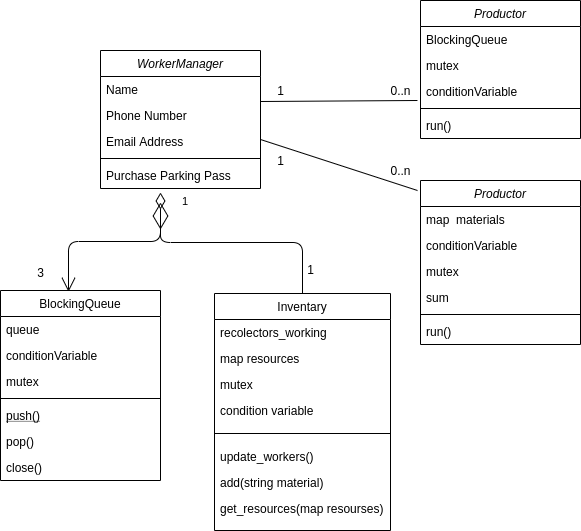
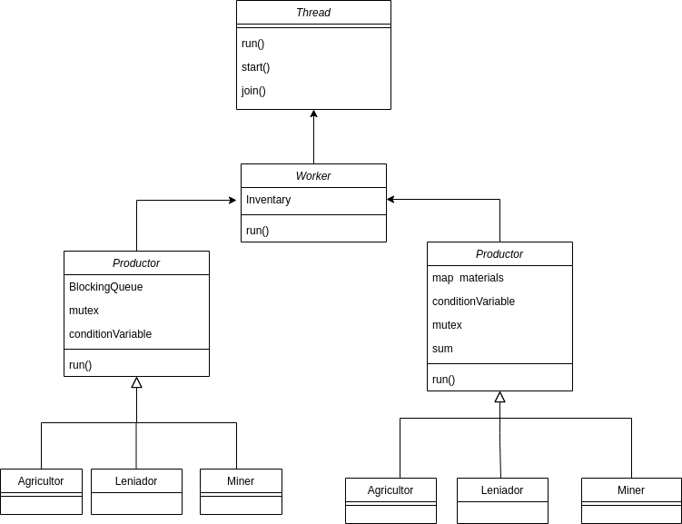

# tp2

* Nombre y apellido: Agostina Vásquez
* Padrón: 99689
* Link al repositorio: https://github.com/agosvasquez/tp2

A continuacion se describirán las clases mas importantes:

* Inventario: Tiene la responsabilidad de almacenar los recursos y las cantidades.Al ser un recurso compartido es necesario proteger nuestro mapa con recursos, para lo cual se usa una condition variable y un mutex. Cuando añado algo al inventario, despierto a los threads productores para cumplir con que sean consumidos tan pronto esten disponibles. Por otra parte el sacar los recursos lo que hace es chequear para cada productor si tiene los materiales que los mismos necesitan y en el caso de que no sea así, se los hace esperar hasta que vuelva a ingresar un recurso y asi volver a chequear la condicion. En el caso de que no se le vayan a agregar mas cosas al inventario, este maneja un contador con la gente que esta insertando entonces, a medida que cada recolector termina decrementa el contador.

* Colas bloqueantes: Son colas comunes pero como los mismos tipo de recolectores tienen la misma cola asociada, va a haber varios thread accediendo a ellas. Para lo cual se hace un wait cuando se quiere hacer un pop y esta vacia, y se despierta a los threas en cuanto se hace un push(analogo a lo anterior).

* Recolectors: Es la clase padre de todos los recolecores y quien tiene la lógica. Cada recolector tiene una cola asociada de la cual saca elementos, realiza trabajo(sleep) y los guarda en el inventario. Si devuelve un elemento vacio quiere decir que no hay mas elementos y envia el mesaje al inventario que ya no va a enviar más recursos. 

* Producer: Es la clase padre de todos los productores y es quien tiene la lógica de estos. Cada producer va a pedirle al inventario sus materiales, realiza trabajo(sleep) y luego genera puntos. Los puntos al ser un recurso compartido utilizan un mutex.

* Worker manager: va a ser el encargado de crear los workers, es decir recolectores y productores, es quien tiene las colas, la sumatoria de puntos final y el inventario como atributos.Fue pensado asi con el proposito de que todo lo que se relacione a los workers sea manejado dentro del manager. Tambien se encarga de guardar dentro de la cola los elementos e imprimir la salida final.

